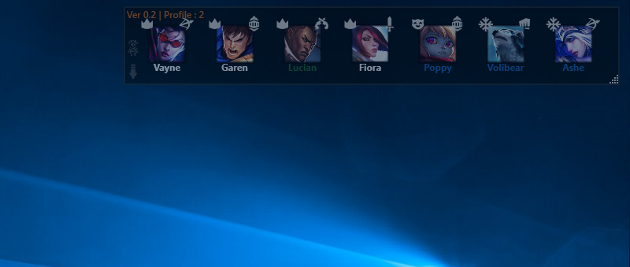
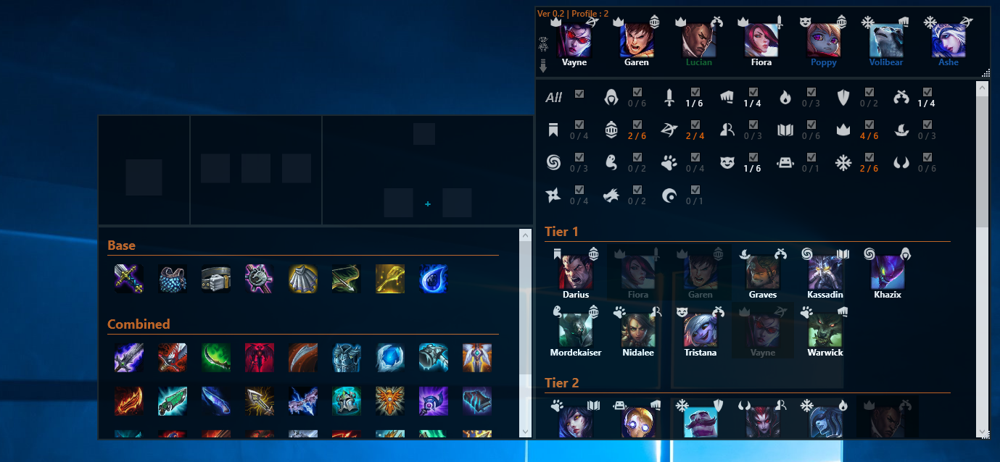
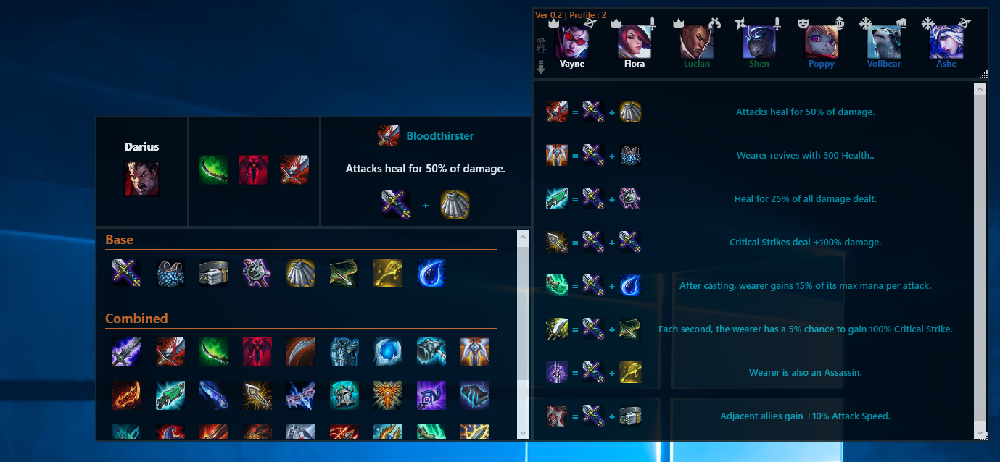
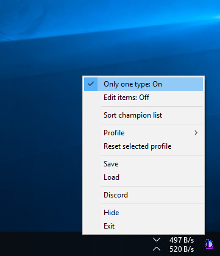

## Last Version
**Antize TFT (Ver.0.3)**

## Preview

## Antize TFT Overlay
Free character and object manager for League of Legends: Teamfight Tactics.

Antize TFT Overlay can be put over your game to get an overview of characters and objects while playing, your game must set in Borderless or Windowed

LoL: Teamfight Tactics, League of Legends: TFT.

## Do you have an issue ?
Do you have an issue or if you think there is an error in data, just open an issue or send me a message through Discord, I will proceed to the changes as soon as possible.

[Come on Discord:](https://discord.gg/GXZwBeG) https://discord.gg/GXZwBeG

## Known issues
- If **Antize TFT Overlay** is launched as admin Malwarebytes detects as false positive, general problem with C# software.
- Windows defender (Smart screen) block for unrecognized app. :)

## How do I get started ?
There are ready-to-use software, just place it in a folder for example on the desktop and run.

To put Antize TFT on top of your game, your game must set in Borderless or Windowed

Inside of package, you must have the following files:
- **Antize TFT.exe:** Software
- **MyProfile.xml:** User settings

## Prerequisite
May be **Net Framework 4.0**

## Authors
- Antize

## License
Copyright@2019 Antize all rights reserved.

En téléchargeant vous acceptez la récolte de données non sensible.
